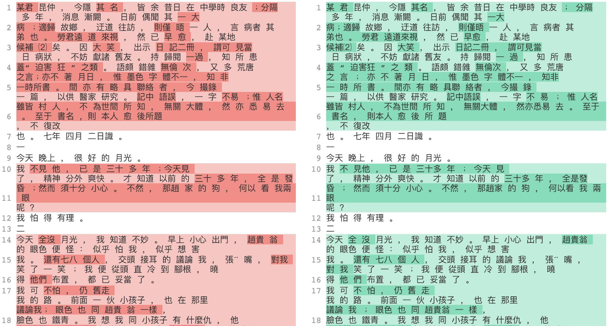
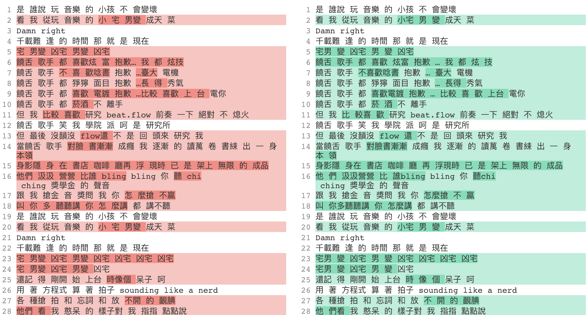

# Part-of-speech tagging for Chinese
Part-of-speech tagging takes a text and marks grammatical information about all the words (and sometimes associated elements, like punctuation). This is a key step in enabling you to answer questions specific to language use in the text.

Part-of-speech (POS) taggers generally assume there are spaces between "words" in the text being processed. For this exercise, we will use the [Stanford Word Segmenter](https://nlp.stanford.edu/software/segmenter.shtml), before running the [Stanford POS Tagger](https://nlp.stanford.edu/static/software/tagger.shtml).

## 1. Download the segmenter
Click on the "Download Stanford Word Segmenter version 3.9.2" (or some other version) that appears [under the "Download" heading on this page.](https://nlp.stanford.edu/software/segmenter.shtml#Download) Save this zip file, and unzip it once it's finished downloading. This will give you a new folder (probably in your Downloads directory) named _stanford-segmenter-2018-10-16_.

## 2. Prepare your text
To use the segmenter, you need to have the text you're working with saved as a Unicode (UTF-8) text file. Two example text files you can use for this exercise are BLAH and BLAH. 

You should also name the file without any spaces; e.g. instead of *my example file.txt*, name it *my-example-file.txt*, *my_example_file.txt*, *myexamplefile.txt*. Spaces mean something else when you're working with the command line, and while there's workarounds for using a file with spaces in its name, it's easiest to just avoid it.

It will be simplest for you to run the segmentation if you copy your text file into the _stanford-segmenter-2018-10-16_ folder that you unzipped. If you're comfortable navigating file paths in the command line, you can skip this step.

Two example files you can work with for this tutorial are:

* An excerpt of the lyrics of the song ["Murderer"](murderer.txt) by Xiong Zi (Taiwanese rapper)
* A few paragraphs from Lu Xun's ["A Madman's Diary"](madman.txt)

## 3. Run the segmenter
The segmenter comes with two models: *pku* (Bejing/Peking University) and *ctb* (Chinese Treebank). You can try to run it with each one in turn and see which performs best for your text, though if you want to choose one as the default, go with *pku*, which may be more likely to correctly identify compounds.

**On a Mac**
Open the Terminal (_Applications > Utilities > Terminal_).

Change to the segmenter directory. If the directory has been unzipped in the Downloads folder, type:
`cd Downloads/stanford-segmenter-2018-10-16`
and press return. You should now see a prompt that looks like: _YourComputerName:stanford-segmenter-2018-10-16 YourUserName_$

If you think moved your text file into that directory and want to double-check that it's there before moving on to the next step, you can run:
`ls`
You should see your text file among the files listed.

In the following line, change **yourfile.txt** to the name of your file. You can also change **youroutput.txt** to another file name, but be sure to differentiate it from the source file in some way.
`./segment.sh pku yourfile.txt UTF-8 0 > youroutput.txt`

If you chose not to move your text file into the folder with the segmenter, you'll need to specify the correct path to the file when you run this command.

*(Thanks to Michelle Fullwood for her [Chinese text parsing tutorial](http://michelleful.github.io/code-blog/2015/09/10/parsing-chinese-with-stanford/).)*

## 4. Compare segmenter outputs
If you want to try both segmenters and see which performs best on your text, you can run the command above twice, once with *pku* and once with *ctb*. Just be sure to change the output file name for the second one, otherwise you'll overwrite the first output file.

Here are the segmented outputs for the sample text:

* ["A Madman's Diary" segmented with pku](madman-segmented-pku.txt)
* ["A Madman's Diary" segmented with ctb](madman-segmented-ctb.txt)
* ["Murderer" segmented with pku](murderer-segmented-pku.txt)
* ["Murderer" segmented with ctb](murderer-segmented-ctb.txt)

Open both of your files with the outputs of the different segmenters. Head to [DiffChecker](https://diffchecker.com), and copy and paste the contents of one file in one of the boxes, and copy and paste the other file into the other box. Scroll to the bottom of the page (past the ads) and click the green "Find differences" button. The results will highlight the differences between the texts.

Here are the comparisons for the example text:
### "A Madman's Diary" segmenter comparison

### "Murderer" segmenter comparison

Even for a non-Chinese-speaker, it's interesting to see how the segmenters handle the insertion of English (and Latin-transcribed sounds). *pku* (left) is better about not attaching Chinese to this text, though you still get *flow還*.

## 4. Download the POS tagger
The [Stanford part-of-speech tagger](https://nlp.stanford.edu/static/software/tagger.shtml) includes code for performing part-of-speech tagging, along with a number of language-specific models that have been trained on different kinds or quantities of texts, and that use different sets of grammatical tags.

Go to the ["Downloads" section of the page](https://nlp.stanford.edu/static/software/tagger.shtml#Download) and click on "Download full Stanford Tagger version 3.6.0 [124 MB]" (the available version number may vary.)

Save the zip file to your computer, and unzip it when it's done downloading.

### Chinese POS tags
The Chinese tagger uses tags defined by the [Penn Chinese Treebank](https://catalog.ldc.upenn.edu/LDC2010T07). The treebank was built on a corpus of newswire (Agence France Presse, China News Service, Guangming Daily, Peoples Daily, Xinhua News Agency), news magazine (Sinorama), broadcast news (China Broadcasting System, China Central TV, China National Radio, China Television System, New Tang Dynasty TV, Phoenix TV, Voice of America), broadcast conversation (Anhui TV, China Central TV, CNN, MSNBC, New Tang Dynasty TV, Phoenix TV), newsgroups, and weblogs.

| Tag | Description | Example |
| AD | adverb | 也 |
| AS | aspect marker | 着 |
| BA | 把 in ba-construction | 把 |
| CC | coordinating conjunction | 和 |
| CD | cardinal number | 一百 |
| CS | subordinating conjunction | 虽然 |
| DEC | 的 in a relative-clause | 的 |
| DEG | associative | 的 |
| DER | in V-de const. and V-de-R | 得 |
| DEV | 地 before VP | 地 |
| DT | determiner | 这 |
| ETC | for words 等, 等等 | 等, 等等 |
| FW | foreign words | A |
| IJ | interjection | 哈哈 |
| JJ | other noun-modifer | 新 |
| LB | 被 in long bei-const | 被 |
| LC | localizer | 里 |
| M | measure word | 个 |
| MSP | other particle | 所 |
| NN | common noun | 工作 |
| NR | proper noun | 中国 |
| NT | temporal noun | 目前 |
| OD | ordinal number | 第一 |
| ON | onomatopoeia |  |
| P | Prepositions (excluding 把 and 被) | 在 |
| PN | pronoun | 我 |
| PU | punctuation | 标点 |
| SB | 被 in short bei-const | 被 |
| SP | sentence-final particle | 吗 |
| VA | predicative adjective | 好 |
| VC | copula | 是 |
| VE | 有 as the main verb | 有 |
| VV | other verbs | 要 |
| X | numbers and units, mathematical sign | 59mm |

## 5. Relocate your text file
Take the text file that was generated by the segmenter (**youroutput.txt**, or whatever you chose to name it in step 3), and copy it into the folder that was created by unzipping the POS tagger file, _stanford-postagger-full-2018-10-16_ or something similar. This step is optional if you're comfortable specifying file locations using the command line.

## 6. Run the tagger
**On a Mac**
Open a new terminal window, and navigate to the POS tagger folder. Unless you saved it somewhere else, you should be able to enter:
`cd Downloads/stanford-postagger-full-2018-10-16`

Once again, you can run `ls` and check for the name of your text file if you want to make sure you moved it into the right folder.

Run the following command, replacing **youroutput.txt** with the name of your output file from the segmenter:

`java -cp "*" edu.stanford.nlp.tagger.maxent.MaxentTagger -model models/chinese-nodistsim.tagger -textFile youroutput.txt -outputFormat tsv -outputFile yourposoutput.txt`

A few lines of text should appear, concluding with a message along the lines of *Tagged 768 words at 864.86 words per second.* (where the numbers will vary based on your text and your computer)

## 7. Looking at the output
You can open the output in a plain text editor, which will display two columns: one with the Chinese words, and one with the part-of-speech tags.

To be able to sort the results more easily, you can use Excel -- but don't try to open the file directly in Excel, because Excel will mess up the encoding and the result will be jibberish.

Instead, open a new, blank document in Excel. Using hte top navigation bar, go to *Data > Get eternal data > Import text file*. Select the output (look in the folder with the POS tagger), and in the "File origin" dropdown, choose *Unicode (UTF-8)*. Your text should become readable in the preview. The rest of the default settings are fine, so click *Finish*.

When it asks where to put the data, choose the top left column (selected by default) and hit *OK*.

Your text will appear in two columns, with one word per row in the first column, and one tag per row in the second column. A blank row will exist to indicate a new line in your original text. (For instance, if your original text is poetry, each line of the poem will be separated by a blank row.)

You can sort your sheet by column B to see, for instance, all the nouns in the text. Note, though, that this will lose the original sentence-based structure of the file.

If you want to count, for instance, at the average number of nouns per sentence, you'll need to use a different output format from the part-of-speech tagger. In the code above where you ran the POS tagger, you could replace **tsv** with **xml** to get an output file with a format that supports queries that depend on text structure.